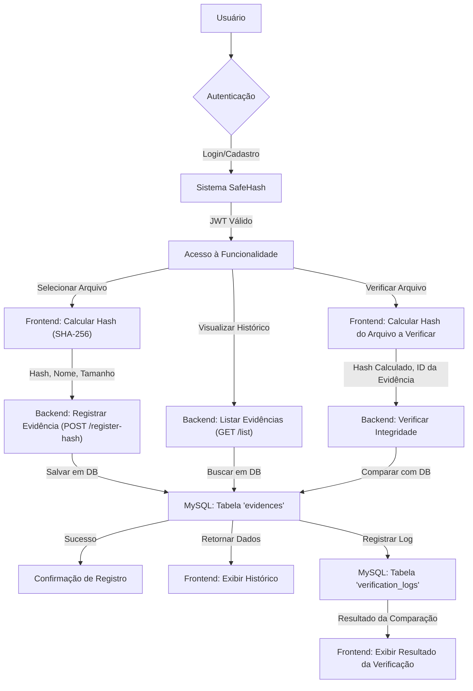

# 🔒 SafeHash

Plataforma para registro e verificação de integridade de arquivos digitais utilizando hashes criptográficos, garantindo a imutabilidade e a rastreabilidade de evidências digitais.

## 📌 Sobre o Projeto

O SafeHash aborda a crescente necessidade de **garantir a autenticidade e a integridade de arquivos digitais**, um desafio crítico em áreas como perícia forense, compliance regulatório e proteção de propriedade intelectual. Em um mundo onde a manipulação de dados é cada vez mais fácil, ter um método confiável para provar que um arquivo não foi alterado desde seu registro é fundamental.

Nossa plataforma permite que usuários (peritos, advogados, empresas) registrem o hash criptográfico de um arquivo, criando uma "impressão digital" única e imutável. Posteriormente, qualquer pessoa pode verificar a integridade desse arquivo, comparando seu hash atual com o hash registrado na plataforma. Isso oferece uma **prova irrefutável de não-alteração** e uma trilha de auditoria transparente.

### Diferenciais principais:

- **Registro de Evidências:** Armazenamento seguro de hashes de arquivos com metadados (nome, tamanho, tipo MIME).

- **Verificação de Integridade:** Funcionalidade para comparar o hash de um arquivo com o hash registrado, confirmando sua autenticidade.

- **Trilha de Auditoria:** Logs detalhados de todas as verificações realizadas, incluindo IP e timestamp.

- **Autenticação Segura:** Sistema de login e registro de usuários com senhas hasheadas (bcrypt) e JWT para controle de acesso.

- **Simplicidade e Eficiência:** Interface intuitiva para upload e verificação, com processamento rápido de hashes.

## 🏗️ Arquitetura

**Padrão Adotado: Monolito Modular**

A arquitetura do SafeHash segue um padrão de **monolito modular**, onde as funcionalidades são agrupadas em módulos lógicos, mas implantadas como uma única unidade. Esta abordagem foi escolhida para acelerar o desenvolvimento do MVP, reduzir a complexidade operacional e facilitar a manutenção, ao mesmo tempo em que permite uma clara separação de responsabilidades entre os domínios do sistema.

### Por que essa arquitetura?

- **Agilidade no Desenvolvimento:** Para um projeto em fase inicial, um monolito modular permite um desenvolvimento mais rápido e iterativo, com menos sobrecarga de comunicação entre serviços.

- **Simplicidade Operacional:** A implantação e o gerenciamento de uma única aplicação são mais simples do que gerenciar múltiplos microsserviços, reduzindo a complexidade de infraestrutura.

- **Coerência de Domínio:** Os domínios de usuário, evidências e logs de verificação possuem um acoplamento natural, tornando o monolito modular uma escolha eficiente para manter a coesão.

- **Escalabilidade Futura:** A modularidade interna facilita a eventual extração de microsserviços para funcionalidades que demandem escalabilidade independente ou tecnologias diferentes, caso o projeto cresça e as necessidades mudem.

## 🛠️ Stack de Desenvolvimento

### Backend

| Ferramenta | Versão | Função |
| --- | --- | --- |
| Node.js | 20 LTS | Runtime JavaScript server-side |
| Express | 4.x | Framework HTTP minimalista |
| TypeScript | 5.x | Tipagem estática |
| `mysql2` | ^3.x | Driver MySQL para Node.js |
| `bcrypt` | ^5.x | Hash seguro de senhas |
| `jsonwebtoken` | ^9.x | Geração e validação de JWT |

### Banco de Dados

| Ferramenta | Função |
| --- | --- |
| MySQL 8 | Banco principal (usuários, evidências, logs) |

### Infraestrutura

| Ferramenta | Função |
| --- | --- |
| Docker | Containerização do serviço de backend |
| Docker Compose | Orquestração local (para subir o banco de dados) |

### Design & Prototipação

| Ferramenta | Função |
| --- | --- |
| draw.io | Diagramas de arquitetura e fluxo de negócio |

## 🔄 Fluxo da Regra de Negócio Principal

O diagrama completo do fluxo de negócio principal está disponível em `docs/safehash_fluxo.drawio`. Abra este arquivo no [draw.io](https://app.diagrams.net/) para visualizar interativamente.

### Resumo do Fluxo End-to-End: Registro e Verificação de Evidências



**Invariantes de Negócio:**

- Um hash de arquivo é único para um determinado conteúdo. Qualquer alteração no arquivo resultará em um hash diferente.

- O registro de uma evidência requer um usuário autenticado.

- A verificação de um arquivo compara o hash fornecido com o hash armazenado, sem modificar a evidência original.

- Todos os registros e verificações são auditáveis através de logs.

## 🔐 Autenticação e Autorização

**Estratégia: JWT (JSON Web Tokens)**

O SafeHash utiliza JSON Web Tokens para gerenciar a autenticação e autorização dos usuários. Após um login bem-sucedido, um JWT é emitido para o usuário, que deve ser incluído nas requisições subsequentes para acessar rotas protegidas.

```
Login (email/cpf, senha) ──► Backend (verifica bcrypt) ──► JWT Gerado
                                                              │
                                                      { id: user.id, cpf: user.cpf, exp: ... }
                                                              │
                                                   Enviado no header:
                                            Authorization: Bearer <token>
```

**Configurações de segurança:**

- **Senhas:** Armazenadas como hashes bcrypt (salt rounds 10).

- **Token:** Assinado com uma chave secreta (`CHAVE_PERICIA_2026` - idealmente uma variável de ambiente) e com expiração de 1 dia.

- **Acesso:** Rotas protegidas exigem um JWT válido e decodificável.

## 📁 Estrutura do Projeto

```
safehash/
├── client/                               # Frontend (React)
│   ├── public/
│   ├── src/
│   │   ├── assets/
│   │   ├── components/
│   │   ├── pages/
│   │   ├── App.tsx
│   │   ├── main.tsx
│   │   └── vite-env.d.ts
│   ├── index.html
│   ├── package.json
│   ├── tsconfig.json
│   └── vite.config.ts
│
├── server/                               # Backend (Node.js + Express)
│   ├── database/
│   │   └── init.sql                      # Esquema do banco de dados
│   ├── src/
│   │   ├── controllers/
│   │   │   ├── authController.ts         # Lógica de autenticação
│   │   │   └── evidenceController.ts     # Lógica de evidências (a ser criada)
│   │   ├── lib/
│   │   │   └── db.ts                     # Conexão com o banco de dados
│   │   │   └── utils.ts                  # Funções utilitárias
│   │   ├── routes/
│   │   │   ├── auth.ts                   # Rotas de autenticação
│   │   │   └── evidence.ts               # Rotas de evidências
│   │   └── index.ts                      # Ponto de entrada do servidor
│   ├── Dockerfile
│   ├── package.json
│   └── tsconfig.json
│
├── shared/                               # Código compartilhado (constantes, tipos)
│   └── const.ts
│
├── docs/                                 # Documentação técnica
│   └── safehash_fluxo.drawio             # Diagrama de fluxo de negócio
│
├── docker-compose.yml                    # Orquestração de serviços Docker
├── .env.example                          # Exemplo de variáveis de ambiente
├── .gitignore
├── package.json                          # Dependências gerais do projeto
├── README.md                             # Este arquivo
└── tsconfig.json
```

## 🚀 Como Rodar Localmente

### Pré-requisitos

- [Docker](https://www.docker.com/get-started) e [Docker Compose](https://docs.docker.com/compose/install/) instalados.

- [Node.js](https://nodejs.org/en/download/) (versão 20 LTS ou superior) e [npm](https://www.npmjs.com/get-npm) (para desenvolvimento fora do container, se necessário).

### Subindo tudo com Docker Compose

1. **Clone o repositório:**

   ```bash
   git clone https://github.com/seu-usuario/safehash.git
   cd safehash
   ```

1. **Copie e configure as variáveis de ambiente:**

   ```bash
   cp .env.example .env
   ```

   Edite o arquivo `.env` com suas configurações locais, como as credenciais do banco de dados e a chave secreta do JWT.

1. **Suba a infraestrutura e o backend:**

   ```bash
   docker-compose up --build -d
   ```

   Este comando irá construir as imagens Docker (se necessário ), criar e iniciar os containers para o banco de dados MySQL e o serviço de backend.

1. **Verifique se os containers estão rodando:**

   ```bash
   docker-compose ps
   ```

1. **Instale as dependências do frontend e inicie-o (em um terminal separado):**

   ```bash
   cd client
   npm install
   npm run dev
   ```

   O frontend estará disponível em `http://localhost:5173` (ou outra porta, conforme configurado pelo Vite ).

### Serviços disponíveis após o `docker-compose up`:

| Serviço | URL Local |
| --- | --- |
| Backend | `http://localhost:3000` |
| MySQL | `localhost:3306` |

## 🛡️ Segurança

A segurança é uma preocupação central no SafeHash. As seguintes medidas foram implementadas:

- **Senhas Hashed:** Todas as senhas de usuários são armazenadas usando bcrypt, um algoritmo de hash robusto, para proteger contra ataques de força bruta e vazamento de dados.

- **JWT:** Utilização de JSON Web Tokens para autenticação, garantindo que apenas usuários autorizados possam acessar recursos protegidos.

- **Validação de Entrada:** Todas as entradas de usuário são validadas no backend para prevenir ataques como injeção SQL e XSS.

- **HTTPS:** Recomenda-se a utilização de HTTPS em ambiente de produção para criptografar a comunicação entre cliente e servidor.

## 📈 Observabilidade

Para garantir a saúde e o bom funcionamento do sistema, o SafeHash prevê a implementação de observabilidade através de:

- **Logs:** Geração de logs detalhados no backend para rastrear eventos importantes, erros e atividades do usuário. Isso facilita a depuração e a auditoria.

- **Monitoramento:** Em um ambiente de produção, ferramentas de monitoramento seriam integradas para acompanhar métricas de desempenho, uso de recursos e disponibilidade do serviço.

